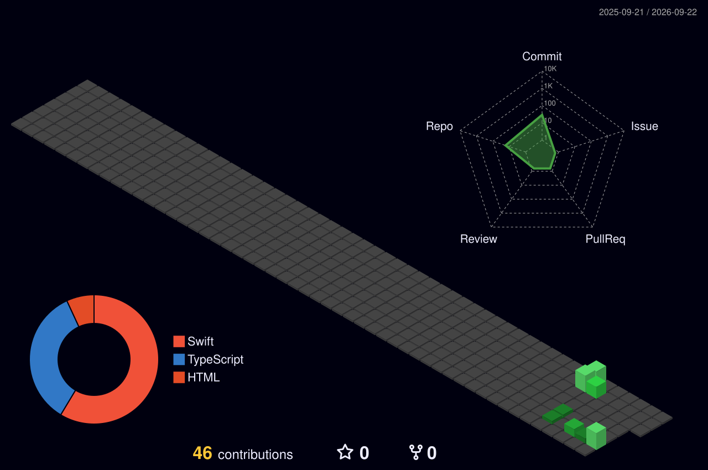

<!--
  GitHub profile README for Diyath Wickramaratne (@diyathw)
  Copy this entire file into the README.md of github.com/diyathw/diyathw.
-->

## Engineering profile

Senior Software Engineer with **~12 years of experience** designing and delivering scalable, cloud-native products across the full stack.

My work has crossed **building-management platforms, fleet telematics and video, veterinary genetics, smart workplaces, and ERP/POS systems**. I build with **Node.js, React/Next.js, C#/.NET Core, MongoDB, and AWS**, choosing architecture that fits the product rather than forcing a favorite pattern.

- Based in **Toronto, Canada**
- Helped scale a production platform from **~1,000 to 162,000+ users**
- Strongest in **backend systems, cloud architecture, and full-stack product delivery**
- Open to **Senior Software Engineer / Senior Full-Stack Engineer** opportunities
- Using **Claude Code and AI-assisted workflows** to accelerate high-quality engineering

## Core toolkit

<table align="center">
  <tr>
    <td align="center" width="110"> TypeScript</td>
    <td align="center" width="110"> JavaScript</td>
    <td align="center" width="110"> Node.js</td>
    <td align="center" width="110"> Express.js</td>
    <td align="center" width="110"> React</td>
    <td align="center" width="110"> Next.js</td>
  </tr>
  <tr>
    <td align="center" width="110"> NestJS</td>
    <td align="center" width="110"> Vue.js</td>
    <td align="center" width="110"> Laravel</td>
    <td align="center" width="110"> C#</td>
    <td align="center" width="110"> .NET Core</td>
    <td align="center" width="110"> AWS</td>
  </tr>
  <tr>
    <td align="center" width="110"> Webpack</td>
    <td align="center" width="110"> Vite</td>
    <td align="center" width="110"> HTML5</td>
    <td align="center" width="110"> CSS3</td>
    <td align="center" width="110"> Linux</td>
    <td align="center" width="110"> Windows</td>
  </tr>
  <tr>
    <td align="center" width="110"> MongoDB</td>
    <td align="center" width="110"> MySQL</td>
    <td align="center" width="110"> Docker</td>
    <td align="center" width="110"> Terraform</td>
    <td align="center" width="110"> Sentry</td>
    <td align="center" width="110"> Actions</td>
  </tr>
  <tr>
    <td align="center" width="110"> Git</td>
    <td align="center" width="110"> Bitbucket</td>
    <td align="center" width="110"> Jira</td>
    <td align="center" width="110"> Confluence</td>
    <td align="center" width="110"> VS Code</td>
    <td align="center" width="110"> Postman</td>
  </tr>
  <tr>
    <td align="center" width="110"> macOS</td>
    <td align="center" width="110"> iOS</td>
    <td align="center" width="110"> GitHub</td>
    <td align="center" width="110"> Redis</td>
    <td align="center" width="110"> PHP</td>
  </tr>
</table>

## Evidence from production

- Helped scale a production pet-health platform from approximately **1,000 to more than 162,000 users**, contributing to backend architecture improvements and its migration to AWS.
- Designed and delivered **Node.js and .NET Core microservices** on an AWS serverless architecture, supported by automated CI/CD pipelines.
- Built secure, event-driven AWS integrations using **Lambda, SQS, SNS, SES, Secrets Manager, IAM roles, and KMS**.
- Managed DNS, TLS certificates, load balancing, cloud infrastructure, edge logic, storage, and content delivery using **Route 53, AWS Certificate Manager, ALB/NLB, S3, CloudFront, Lambda@Edge, CloudFront Functions, CloudFormation, AWS CDK, and Terraform**.
- Deployed and operated containerized workloads using **Docker and AWS Fargate**.
- Built scalable APIs and optimized **MongoDB/Mongoose** data models through schema refinement, indexing, and query improvements.
- Integrated third-party services and payment workflows using **Stripe APIs and webhooks**.
- Developed event-driven fleet and telematics services for GPS, operational events, video processing, live streaming, and geospatial tracking.
- Improved release reliability through cloud monitoring, deployment automation, branch strategies, automated testing, and disciplined code review.
- Applied **Claude Code and other AI-assisted engineering tools** to speed up prototyping, debugging, and refactoring while maintaining human review and engineering standards.

<strong>Career journey</strong> — expand for context

 

- **Optergy** — Building-management interfaces, Node.js APIs, MongoDB optimization, AWS operations, and deployment automation
- **Step Global** — Fleet telematics, geospatial tracking, NVR video workflows, live streaming, and the Smart eDriver platform
- **Orivet Pet Solutions** — Pet-health platform growth, AWS serverless migration, microservices, analytics, and automated reports
- **Eutech Cybernetics Lanka** — Smart-workplace applications, access-control integrations, IoT lighting, and operational dashboards
- **Victory Information** — ERP/POS development with C#, WPF/WCF, SQL Server and Crystal Reports, plus customer support and client-specific workflows

**Education:** BSc in Computer Science — University College Dublin, Ireland

## What I am sharpening

- Building reliable full-stack and backend systems with Node.js, Express.js, React, Next.js, NestJS, Vue.js, Laravel, and .NET Core
- Exploring practical AI-assisted workflows that improve engineering speed and code quality
- Deepening patterns for AWS serverless, asynchronous messaging, observability, and automated testing

## Capability map

**Backend & APIs** 
Node.js · Express.js · NestJS · PHP · Laravel · C# · .NET Core · REST APIs · Microservices · Event-driven architecture

**Frontend** 
React · Next.js · Vue.js · TypeScript · JavaScript · HTML5 · CSS3 · Webpack · Vite · Redux · Material UI · Tailwind CSS

**AWS & infrastructure** 
Lambda · SQS · SNS · SES · EventBridge · S3 · CloudFront · Route 53 · Certificate Manager · IAM · KMS · Secrets Manager · Fargate · ALB/NLB · CDK · CloudFormation · Terraform

**Data & reporting** 
MongoDB · Mongoose · DynamoDB · Redis · MySQL · Microsoft SQL Server · SAP Crystal Reports

**Quality & delivery** 
Test-Driven Development (TDD) · Automated testing · Docker · CI/CD · Playwright · Jest · Sentry · Codacy · GitHub Actions · Bitbucket Pipelines

**Collaboration & tooling** 
Git · GitHub · Bitbucket · Jira · Confluence · Visual Studio Code · WebStorm · Postman · Linux · Windows · macOS · iOS · Branch strategies · Code review

**Integrations** 
Stripe · REST APIs · Webhooks · Google APIs · Shopify

**AI-assisted engineering** 
Claude Code · OpenAI Codex · ChatGPT · Reusable AI skills · Team-agent workflows · Multi-agent orchestration · Sub-agent delegation · AI-assisted planning · Prototyping · Debugging · Refactoring · Human-reviewed delivery

## Open-source activity

<picture>
  <source media="(prefers-color-scheme: dark)" srcset="https://github-readme-stats.vercel.app/api?username=diyathw&show_icons=true&hide_border=true&theme=github_dark&rank_icon=github">
  <source media="(prefers-color-scheme: light)" srcset="https://github-readme-stats.vercel.app/api?username=diyathw&show_icons=true&hide_border=true&theme=default&rank_icon=github">
  
</picture>

<picture>
  <source media="(prefers-color-scheme: dark)" srcset="https://github-readme-stats.vercel.app/api/top-langs/?username=diyathw&layout=compact&hide_border=true&theme=github_dark">
  <source media="(prefers-color-scheme: light)" srcset="https://github-readme-stats.vercel.app/api/top-langs/?username=diyathw&layout=compact&hide_border=true&theme=default">
  
</picture>

<picture>
  <source media="(prefers-color-scheme: dark)" srcset="https://streak-stats.demolab.com?user=diyathw&theme=github-dark-blue&hide_border=true">
  <source media="(prefers-color-scheme: light)" srcset="https://streak-stats.demolab.com?user=diyathw&theme=default&hide_border=true">
  
</picture>

<picture>
  <source media="(prefers-color-scheme: dark)" srcset="https://github-readme-activity-graph.vercel.app/graph?username=diyathw&bg_color=0d1117&color=58a6ff&line=0969da&point=ffffff&area=true&hide_border=true">
  <source media="(prefers-color-scheme: light)" srcset="https://github-readme-activity-graph.vercel.app/graph?username=diyathw&bg_color=ffffff&color=0969da&line=0969da&point=24292f&area=true&hide_border=true">
  
</picture>

### 3D activity view

### Contribution animation

<picture>
  <source media="(prefers-color-scheme: dark)" srcset="https://raw.githubusercontent.com/diyathw/diyathw/output/github-contribution-grid-snake-dark.svg">
  <source media="(prefers-color-scheme: light)" srcset="https://raw.githubusercontent.com/diyathw/diyathw/output/github-contribution-grid-snake.svg">
  
</picture>

## Start a conversation

I'm interested in senior engineering opportunities where I can contribute to scalable architecture, thoughtful product delivery, and strong engineering practices.

<!-- Add 2-4 strong public repositories to your GitHub profile and pin them. -->
